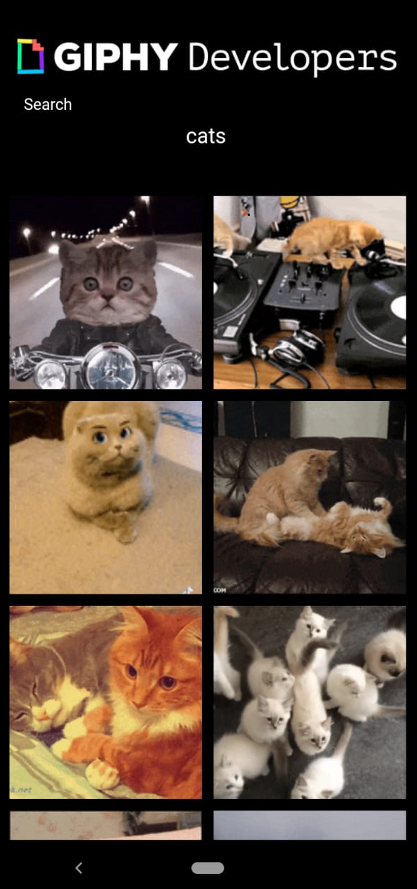

# **Giphy Finder**





```bash
# Clone this repository
$ git clone https://github.com/jovanidesouza/giphy_finder

# Go into the repository
$ cd giphy_finder

# Remove current origin repository
$ git remote remove origin

# run development 
$ flutter run

```
